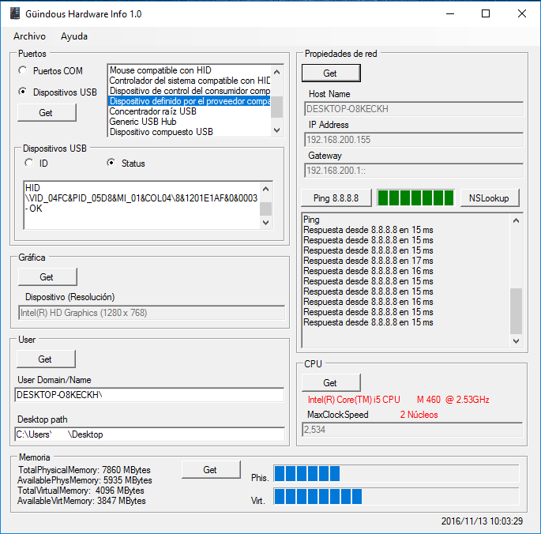

# Hardware Info Tool v 1.0
######Software creado en visual Basic, como proyecto para la asignatura Desarrollo de interfaces del Grado superior de Desarrollo de aplicaicones multiplataforma

#####Es necesario tener [.NET Framework 4](https://www.microsoft.com/es-es/download/details.aspx?id=30653) o superior instalado.

